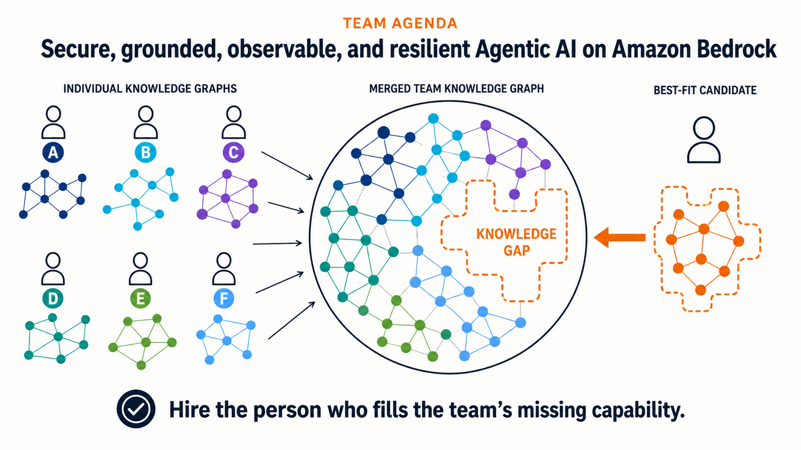

# WEMESH

**Find who completes the team. Know exactly what to ask.**



WEMESH is an interview copilot that compares a candidate's evidence-linked knowledge graph with a team's missing capabilities. It shows where the candidate may add value, explains the supporting profile evidence, and suggests focused interview questions to verify their claims.

This repository contains a demo using a representative AWS GenAI team and one pre-authorized candidate profile snapshot. Profile claims remain unverified until a human reviews them in the interview.

## Run locally

```bash
python3 wemesh_app/server.py --host 127.0.0.1 --port 3000
```

Open [http://localhost:3000](http://localhost:3000). See the [demo guide](wemesh_app/README.md) for the walkthrough and Daytona deployment steps.
