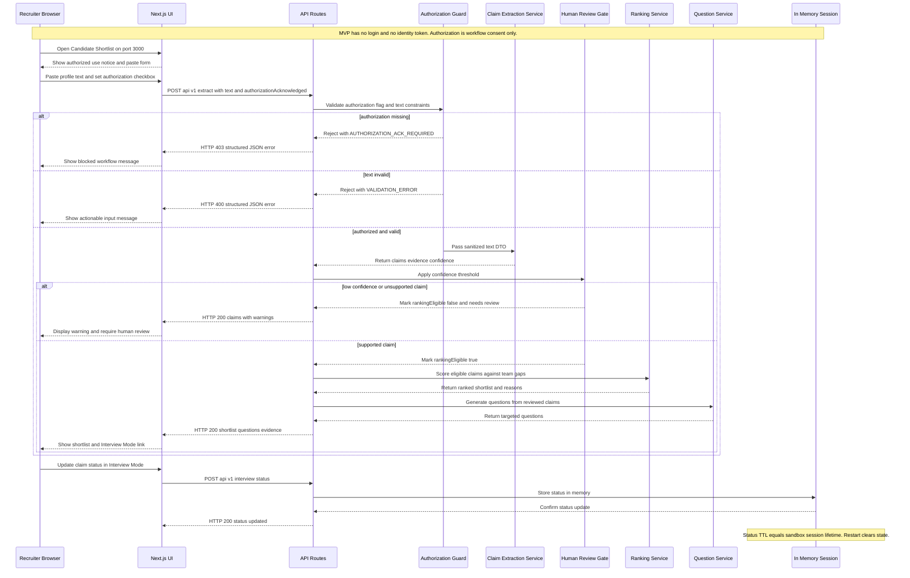
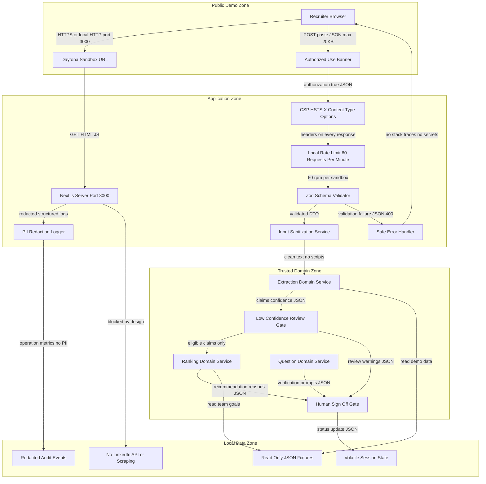
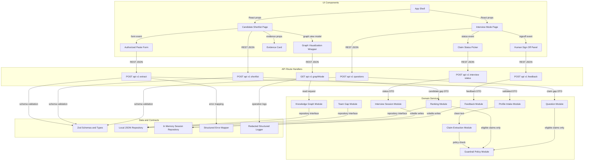
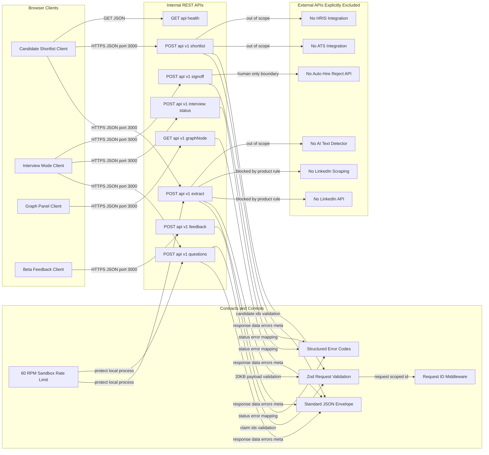
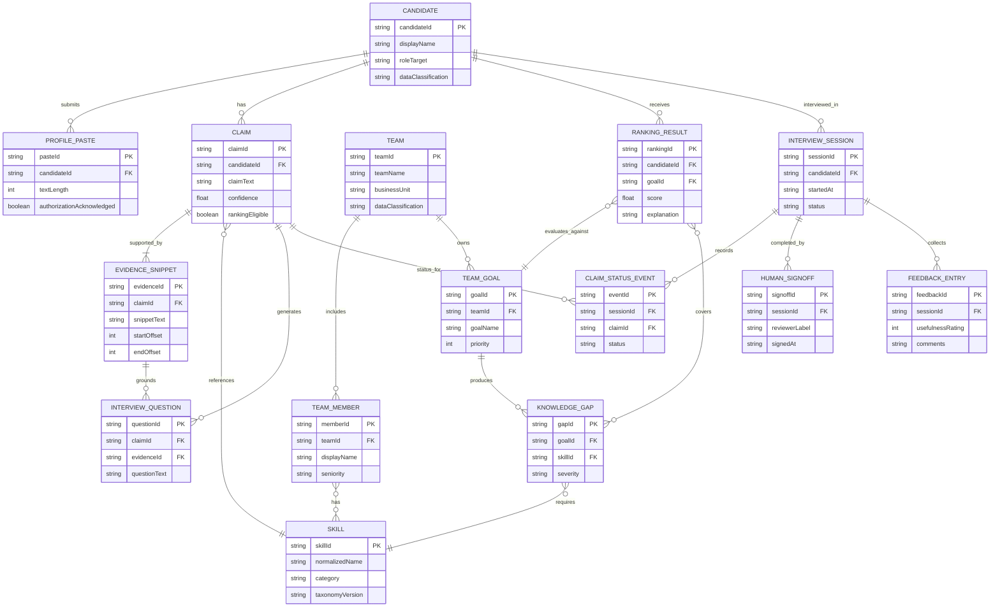

## Architecture Executive Summary

### Project Context
WEMESH is a greenfield Team Knowledge Interview Copilot for recruiting teams. The product helps recruiters, hiring managers, and HR interview operators turn candidate-authorized pasted LinkedIn profile text into evidence-linked knowledge claims, compare those claims against fast-changing team knowledge gaps, rank candidates by team-gap fit, generate targeted verification questions, and manage claim verification status during interviews. The MVP is intentionally constrained: Next.js, TypeScript, two primary views, no authentication, no database, local JSON demo data, no LinkedIn scraping, no LinkedIn API, no AI-generated-text detector, and no automated hire or reject decisions. The app must run in a Daytona sandbox on port 3000 and prove the full demo workflow in under 90 seconds.

### Architectural Philosophy
1. **Human-centered decision support over automation of hiring outcomes.** Ranking and generated questions are explainability aids only. Every shortlist and interview summary requires human sign-off, preserving HR as final decision-maker and reducing over-trust risk.
2. **Deterministic, demo-reliable local execution.** Local JSON fixtures and deterministic TypeScript services keep the MVP portable, fast, reproducible, and compatible with Daytona sandbox operation. This sacrifices production persistence and multi-user audit depth, but it optimizes for the required under-90-second demo.
3. **Evidence-first graph model.** Claims cannot be first-class ranking signals unless linked to evidence snippets and confidence metadata. Low-confidence or unsupported claims remain visible but are excluded from scoring and question generation until reviewed.
4. **Security guardrails despite no authentication.** The MVP lacks identity by explicit constraint, so security relies on local-only demo boundaries, input validation, safe rendering, privacy copy, data minimization, redacted logs, and limited beta operating procedures. Production-grade RBAC is documented as a non-MVP control requirement, not implemented in the MVP.
5. **Operability by design.** Even a sandbox MVP should emit structured client and server telemetry, measure demo duration, surface validation failures, and provide runbook-friendly failure states. The target operational budget is p95 view render under 2 seconds, p95 extraction under 3 seconds for demo data, and complete scripted workflow under 90 seconds in at least 90 percent of runs.

### Intent Alignment
The proposed architecture uses Next.js App Router with TypeScript strict mode for speed of delivery and type safety. Local JSON datasets model candidates, teams, goals, skills, claims, evidence, questions, and graph edges. A server-side extraction module handles pasted text validation, deterministic claim extraction, evidence linking, and confidence assignment without LinkedIn integration. A ranking module computes team-gap fit using explainable weighted scoring and excludes unreviewed low-confidence claims. A question-generation module produces verification prompts only from reviewed or sufficiently supported claims. A lightweight in-memory session state layer supports Interview Mode statuses during the demo without violating the no-database constraint.

### Architecture Decision Records
| Decision | Choice | Alternatives Considered | Rationale | Trade-offs |
|---|---|---|---|---|
| Application platform | Next.js 15 with TypeScript 5 strict mode | Vite React: faster static SPA but weaker server route convention; Remix: strong full-stack model but smaller team ecosystem | Meets explicit stack constraint, supports App Router, API routes, server actions, and a single-process Daytona demo | Next.js SSR boundaries require care for browser-only graph libraries |
| Data persistence | Local JSON fixtures plus in-memory interview session state | SQLite: simple persistence but violates no database; browser localStorage: convenient but harder to govern and clear | Satisfies no database and local demo data constraints while preserving reproducible demo state | No durable multi-user history, no real retention automation, limited audit evidence |
| Profile intake integration | Authorized pasted LinkedIn text only | LinkedIn API: richer metadata but explicitly prohibited; scraping: high legal and platform risk and explicitly prohibited | Aligns with consent-centered intake and avoids third-party dependency failure modes | Manual paste is less convenient and depends on recruiter process discipline |
| Extraction approach | Deterministic TypeScript rule and fixture-backed extraction for MVP | LLM-backed extraction: more semantic but slower and less deterministic; fully pre-tagged display: fastest but weakly demonstrates extraction | Most reliable way to complete end-to-end demo under 90 seconds while preserving traceable evidence snippets | Lower realism for ambiguous language and no semantic generalization beyond rules |
| Graph visualization | Cytoscape.js 3 with dynamic client import | React Flow: better for workflows but weaker dense graphs; D3: maximum flexibility but higher implementation cost | Good fit for relationship graph of candidates, skills, gaps, evidence, and questions with manageable learning curve | Adds browser-only dependency and requires SSR-disabled wrapper |
| Ranking model | Explainable weighted score with blocked low-confidence claims | Embedding similarity: stronger semantic match but opaque and needs model ops; manual ranking: safer but fails product value | Supports recommendation reasons, ranking inversion, and human review gates with transparent math | Requires product-owned weight calibration and can be oversimplified |
| Security posture | Controlled beta, no auth, local-only demo, strong validation and safe output encoding | Add OAuth now: stronger access control but violates MVP no-auth constraint; public anonymous deployment: easy but unacceptable for PII | Honors explicit no-auth constraint while mitigating risk through environment and process boundaries | Not suitable for open internet or production candidate PII without future identity and audit controls |
| Deployment target | Daytona sandbox port 3000 with automated npm scripts and health endpoint | Vercel preview: excellent Next.js hosting but not requested target; Docker Compose: reproducible but more setup overhead | Matches fixed runtime requirement and keeps demo startup under 2 minutes | Sandbox availability becomes a single demo dependency |
| Observability | Structured console logs, web vitals, demo timer, health checks | Full OpenTelemetry stack: production-grade but heavy for MVP; no telemetry: fastest but operationally blind | Gives SRE teams enough signal for demo reliability without introducing external services | Logs are local and ephemeral unless exported during beta sessions |
| Compliance controls | GDPR CCPA SOC 2-style control mapping in architecture and UX copy | Ignore until production: faster but conflicts with PRD; implement full compliance automation now: overbuilds MVP | Establishes privacy, classification, audit, and sign-off expectations early while respecting no database | Some controls are procedural in MVP rather than technically enforceable |

```mermaid

```

---

## System Architecture Overview

### Target System Design
The proposed architecture is a single Next.js TypeScript application optimized for a controlled Daytona sandbox demo. The system is intentionally monolithic at runtime because the MVP has no database, no authentication, no external platform integrations, and a strict time-to-value requirement. Separating the design into clear internal modules still matters: profile intake, extraction, graph assembly, team-gap analysis, ranking, question generation, and interview status handling must remain independently testable and observable.

### Runtime Boundaries
The browser hosts the two required user experiences: Candidate Shortlist and Interview Mode. Candidate Shortlist includes authorized paste intake, evidence review, team goal selection, gap visualization, ranking inversion, and recommendation reasons. Interview Mode includes claim-centric questions and status transitions: Claimed, Needs Follow-up, Verified, and Not Verified. Browser-only graph rendering is isolated behind a dynamic Cytoscape.js wrapper to avoid SSR failures.

The Next.js server runtime exposes typed API routes under `/api/v1` for extraction, graph retrieval, shortlist scoring, question generation, interview session state, feedback capture, and health checks. These routes call pure TypeScript domain services. Local JSON fixtures under `/data` act as immutable demo sources for team profiles, goals, skills, candidates, evidence, and graph seed data. In-memory state is acceptable only for demo session mutations such as claim status and feedback because durable persistence is out of scope.

### ADR
| Decision | Choice | Alternatives Considered | Rationale | Trade-offs |
|---|---|---|---|---|
| Runtime topology | Single Next.js process on port 3000 | Separate API service: cleaner scaling but overkill; static SPA only: simpler but weaker server-side validation | Minimizes operational moving parts and satisfies Daytona constraint | Process restart clears in-memory interview status |
| Module boundaries | Domain services behind API routes | UI-only business logic: faster but hard to test; microservices: scalable but excessive | Keeps framework coupling low and enables unit tests for scoring and extraction | Requires discipline to avoid leaking UI state into domain modules |
| Data access | Read-only JSON repository interfaces | Direct JSON imports everywhere: faster but creates coupling; database repository: violates MVP | Supports dependency injection and testability while honoring no database | No concurrent write support or durable audit |

### Operational Targets
- App startup in Daytona: under 120 seconds from `npm install` plus `npm run dev`.
- Health endpoint: `/api/health` p95 under 50 ms.
- Shortlist page initial render: p95 under 2 seconds for 10 candidates, 5 team members, 25 claims per candidate.
- Extraction API: p95 under 3 seconds for pasted profile text up to 20 KB.
- Workflow budget: under 90 seconds in at least 90 percent of scripted demo runs.

### Failure Modes and Mitigations
- **Malformed pasted text:** server schema validation returns HTTP 400 with actionable message and no candidate session created.
- **Graph renderer crash:** page falls back to evidence and ranking tables so the demo can continue.
- **Missing JSON fixture:** health check fails fast and identifies the missing dataset.
- **Low-confidence extraction:** claim remains visible but cannot affect ranking or prompt generation until human review.
- **Sandbox restart:** seed data reloads from JSON; operators rerun the demo script rather than relying on persisted state.

```mermaid
flowchart TD
subgraph clientZone["Client Layer"]
Recruiter["Recruiter Browser"]
ShortlistView["Candidate Shortlist View"]
InterviewView["Interview Mode View"]
GraphPanel["Cytoscape Graph Panel"]
EvidencePanel["Evidence Review Panel"]
end
subgraph edgeZone["Next.js Web Layer"]
NextApp["Next.js App Router"]
ApiRoutes["API Routes under api v1"]
HealthApi["Health Endpoint"]
InputGuard["Zod Input Validation"]
SafeRenderer["Safe Output Encoding"]
end
subgraph domainZone["Domain Service Layer"]
ExtractionSvc["Claim Extraction Service"]
GraphSvc["Knowledge Graph Service"]
GapSvc["Team Gap Service"]
RankingSvc["Team Fit Ranking Service"]
QuestionSvc["Interview Question Service"]
SessionSvc["Interview Session Service"]
FeedbackSvc["Beta Feedback Service"]
end
subgraph dataZone["Local Demo Data Layer"]
CandidateJson["candidates JSON"]
TeamJson["teams JSON"]
GoalJson["team goals JSON"]
ClaimJson["claims JSON"]
EvidenceJson["evidence JSON"]
QuestionJson["questions JSON"]
MemoryStore["In Memory Session Store"]
end
Recruiter -->|"HTTPS localhost 3000 HTML JSON"| ShortlistView
Recruiter -->|"HTTPS localhost 3000 HTML JSON"| InterviewView
ShortlistView -->|"fetch REST JSON port 3000"| ApiRoutes
InterviewView -->|"fetch REST JSON port 3000"| ApiRoutes
GraphPanel -->|"client data JSON"| ShortlistView
EvidencePanel -->|"client events JSON"| ShortlistView
ApiRoutes -->|"HTTP GET health JSON"| HealthApi
ApiRoutes -->|"validated payload max 20KB"| InputGuard
InputGuard -->|"typed DTOs"| ExtractionSvc
InputGuard -->|"typed DTOs"| RankingSvc
InputGuard -->|"typed DTOs"| QuestionSvc
InputGuard -->|"typed DTOs"| SessionSvc
ExtractionSvc -->|"read UTF8 JSON"| CandidateJson
ExtractionSvc -->|"claim evidence objects"| EvidenceJson
GraphSvc -->|"nodes links JSON"| CandidateJson
GraphSvc -->|"nodes links JSON"| TeamJson
GraphSvc -->|"nodes links JSON"| ClaimJson
GapSvc -->|"goal capability JSON"| GoalJson
GapSvc -->|"team member skills JSON"| TeamJson
RankingSvc -->|"gap coverage JSON"| GapSvc
RankingSvc -->|"reviewed claims only"| ClaimJson
QuestionSvc -->|"supported claim JSON"| EvidenceJson
QuestionSvc -->|"template JSON"| QuestionJson
SessionSvc -->|"claim status updates"| MemoryStore
FeedbackSvc -->|"beta feedback JSON event"| MemoryStore
ApiRoutes -->|"sanitized JSON responses"| SafeRenderer
SafeRenderer -->|"REST JSON 200 400 422"| ShortlistView
SafeRenderer -->|"REST JSON 200 400 422"| InterviewView
```

---

## Data Flow Diagram

### Data Flow Intent
The data flow is designed around consent, traceability, and explainable transformation. The only intake path is manual, authorized LinkedIn profile text paste. The system must not scrape LinkedIn, call LinkedIn APIs, or infer final hiring outcomes. Each downstream artifact must retain provenance back to user-provided text or local demo fixtures so recruiters and hiring managers can understand why a candidate ranked higher or why a question was generated.

### Processing Pipeline
Profile text enters through the Candidate Shortlist view after an authorization acknowledgment. The server validates size, required authorization flag, minimum text length, character normalization, and dangerous markup. For MVP capacity, the recommended limits are 20 KB maximum pasted text, 500 character minimum for extraction, and p95 validation under 100 ms. The extraction service produces claims, skills, projects, dates, evidence snippets, confidence scores, and unsupported warnings. Evidence snippets should include source offsets where possible, for example start and end character positions, so the UI can highlight supporting text.

Team and goal data flow from local JSON fixtures. The team-gap service computes missing or under-covered capabilities by comparing required goal capabilities against skills represented by team members. The ranking service then compares reviewed candidate claims to prioritized gaps. Low-confidence or unsupported claims are blocked from scoring unless explicitly reviewed by the human operator. The question service generates verification questions only from reviewed or supported claims and links each question to claim ID, evidence ID, gap ID, and confidence.

### ADR
| Decision | Choice | Alternatives Considered | Rationale | Trade-offs |
|---|---|---|---|---|
| Source data | Local JSON plus pasted text | External ATS HRIS: useful later but out of scope; LinkedIn API: prohibited | Provides deterministic demo data and compliant manual intake | Limited realism and no live enterprise integration |
| Transformation style | Synchronous request response pipeline | Background jobs: robust but unnecessary for small demo; streaming extraction: richer UX but more complexity | Keeps the 90 second demo predictable and simple to operate | Large inputs would block the request in future scale scenarios |
| Confidence gating | Block low-confidence claims from ranking and prompts until reviewed | Hide low-confidence claims: less transparent; include with penalty: still risks influence | Matches PRD decision anchor and reduces over-trust | Requires extra UX state and user education |

### Data Quality Controls
- Empty or short text returns HTTP 400 and no candidate analysis artifact.
- Unsupported claims are assigned `confidence < 0.60` and `rankingEligible = false`.
- Human-reviewed claims can become `rankingEligible = true` only through explicit review action.
- Recommendation reasons must include at least one evidence reference or display an unfilled-gap reason.
- Generated questions must trace to claim, evidence, and team gap IDs.

### Storage and Retention Expectations
The MVP stores canonical demo data in local JSON and mutable interview state in memory. No browser localStorage should be used for candidate PII by default. In a controlled beta, operators should clear pasted text by refreshing or restarting the sandbox at the end of each session. For compliance planning, candidate pasted text and derived claims should be treated as Restricted data, while team goals are Internal and demo skills taxonomy is Internal. Because durable storage is out of scope, automated purge is procedural for MVP: sandbox teardown immediately after demo or within 24 hours of a beta session.

```mermaid
flowchart LR
subgraph intakeZone["Intake and Validation"]
PasteBox["Authorized Profile Paste"]
ConsentCheck["Authorization Acknowledgment"]
TextValidator["Text Size and Schema Validator"]
Sanitizer["HTML and Script Sanitizer"]
ErrorResponse["Actionable Validation Error"]
end
subgraph extractionZone["Extraction and Evidence Linking"]
Extractor["Deterministic Claim Extractor"]
SkillNormalizer["Skill Normalizer"]
EvidenceLinker["Evidence Snippet Linker"]
ConfidenceScorer["Confidence Scorer"]
ReviewGate["Human Review Gate"]
end
subgraph graphZone["Graph and Gap Processing"]
TeamLoader["Team JSON Loader"]
GoalLoader["Team Goal JSON Loader"]
GraphBuilder["Knowledge Graph Builder"]
GapAnalyzer["Team Gap Analyzer"]
Ranker["Team Fit Ranker"]
QuestionGen["Question Generator"]
end
subgraph outputZone["User Outputs"]
Shortlist["Ranked Candidate Shortlist"]
Reasons["Recommendation Reasons"]
Warnings["Low Confidence Warnings"]
Questions["Targeted Interview Questions"]
InterviewStatus["Interview Claim Status"]
Feedback["Beta Feedback Capture"]
end
PasteBox -->|"plain text max 20KB"| ConsentCheck
ConsentCheck -->|"authorized true JSON"| TextValidator
TextValidator -->|"invalid 400 JSON"| ErrorResponse
TextValidator -->|"valid UTF8 text"| Sanitizer
Sanitizer -->|"clean text DTO"| Extractor
Extractor -->|"claim candidates JSON"| SkillNormalizer
SkillNormalizer -->|"normalized skills JSON"| EvidenceLinker
EvidenceLinker -->|"claim evidence offsets JSON"| ConfidenceScorer
ConfidenceScorer -->|"confidence scores JSON"| ReviewGate
ReviewGate -->|"unsupported claims JSON"| Warnings
TeamLoader -->|"teams JSON file"| GraphBuilder
GoalLoader -->|"goals JSON file"| GapAnalyzer
GraphBuilder -->|"nodes links JSON"| GapAnalyzer
GapAnalyzer -->|"prioritized gaps JSON"| Ranker
ReviewGate -->|"eligible claims JSON"| Ranker
Ranker -->|"ranked candidates JSON"| Shortlist
Ranker -->|"score explanation JSON"| Reasons
ReviewGate -->|"reviewed claims JSON"| QuestionGen
GapAnalyzer -->|"gap context JSON"| QuestionGen
QuestionGen -->|"question list JSON"| Questions
Questions -->|"status events JSON"| InterviewStatus
Shortlist -->|"rating event JSON"| Feedback
```



---

## Authentication & Authorization Flow

### MVP Identity Boundary
The MVP explicitly has no authentication. This section therefore defines the authorization-like controls that remain necessary for a recruiting demo handling candidate profile text. The key distinction is that WEMESH does not identify users or enforce role-based access in the MVP, but it still enforces workflow authorization: the recruiter must confirm that the pasted LinkedIn profile text is authorized for recruiting review before processing begins.

### Trust Model
All MVP users are controlled beta or demo participants operating inside a Daytona sandbox. The application must not be exposed as an unauthenticated public recruiting service. Because there is no login, the blast radius of a shared sandbox is the entire in-memory demo session. To reduce risk, the design avoids durable PII storage, masks sensitive text in logs, uses local JSON fixtures, and requires sandbox teardown or restart after sessions involving real pasted text.

### Flow Behavior
The authorization acknowledgment is mandatory. If it is absent, the intake API returns HTTP 403 with a structured error such as `AUTHORIZATION_ACK_REQUIRED`. If pasted text is empty or too short, the API returns HTTP 400. If a claim is low-confidence, the response is successful but includes `rankingEligible = false`, warning metadata, and a required human-review action. Interview Mode status updates do not represent authentication events; they are local session events and must be displayed as human-entered judgments, not system determinations.

### ADR
| Decision | Choice | Alternatives Considered | Rationale | Trade-offs |
|---|---|---|---|---|
| MVP identity | No authentication by constraint | OAuth 2.0 OIDC: required for production but violates MVP constraint; shared password: weak and creates false security | Honors explicit technical constraint and keeps Daytona demo friction low | Not acceptable for public internet or real multi-tenant production use |
| Intake authorization | Mandatory explicit checkbox and API field | Passive notice only: insufficient consent signal; signed consent upload: heavier than MVP | Creates a clear human attestation before processing profile text | Does not cryptographically prove candidate consent |
| Access control | Procedural beta participant control | App-level RBAC: stronger but out of scope; IP allow-list: possible but Daytona-dependent | Matches limited beta posture with minimal implementation overhead | Weak technical enforcement if sandbox URL is broadly shared |

### Operational Controls
- Demo operator must verify sandbox URL is shared only with approved participants.
- The app must show an authorized-use reminder before every paste submission.
- Server must reject requests where `authorizationAcknowledged !== true`.
- No candidate PII should be written to persistent logs; logs include operation ID, event type, and redacted counts only.
- A production readiness gate must require OIDC, RBAC, audit persistence, and administrative access control before broader rollout.

### Failure Modes
The highest-risk failure mode is users mistaking no-auth MVP behavior for production security. The UI and README should label the application as a controlled demo. Another failure mode is accidental processing of unauthorized profile text. The server-side gate mitigates accidental UI bypass. Finally, because all mutable state is in memory, two users sharing one sandbox can see the same session state; limited beta operating procedures must provide one sandbox per session where real candidate text is used.



---

## Security Architecture

### Defense-in-Depth for a No-Auth MVP
The proposed security architecture acknowledges a hard constraint: no authentication and no database in the MVP. That means several production-grade controls are intentionally not implemented in the demo, but the architecture must still prevent avoidable privacy, injection, and over-trust failures. The core security posture is controlled beta exposure, local execution, strict input validation, safe rendering, data minimization, redacted logs, and explicit human sign-off.

### Security Zones
The public zone is the user browser accessing Daytona on port 3000. The application zone is the Next.js process with API routes and server-side domain services. The data zone consists of local JSON fixtures and volatile in-memory state. There are no external LinkedIn, ATS, HRIS, LLM, or database connections in MVP. This absence reduces integration attack surface and cost, but it also limits audit durability and enterprise access control.

### Privacy and Compliance Controls
Candidate profile text is Restricted data. Extracted claims, evidence snippets, and interview statuses are also Restricted because they may contain PII and employment-related evaluation data. Team goals and skill taxonomy are Internal unless they reveal confidential strategy. Logs must not contain raw pasted text, evidence snippets, or candidate names. Structured logs should include operation name, request ID, result status, duration, number of claims, number of low-confidence claims, and redacted actor label such as `demo_operator`.

### ADR
| Decision | Choice | Alternatives Considered | Rationale | Trade-offs |
|---|---|---|---|---|
| Exposure model | Controlled Daytona sandbox only | Public anonymous deployment: easier sharing but unsafe; authenticated production pilot: safer but out of MVP scope | Limits blast radius while honoring no-auth constraint | Depends on operational discipline and URL control |
| Input defense | Zod schemas, length limits, sanitization, output encoding | Client-only validation: bypassable; raw HTML rendering: XSS risk | User-pasted text is untrusted and must be treated as hostile | Adds validation work and some false rejects |
| Logging | Redacted structured logs | Full payload logs: easy debugging but privacy risk; no logs: poor operability | Balances SRE troubleshooting with privacy obligations | Harder to debug extraction edge cases without secure payload capture |
| Data protection | No durable PII by default | Local file writes: useful audit but creates retention burden; browser storage: convenient but privacy risk | Best fit for no database and controlled demo | Audit logging is limited and procedural |

### Threats and Mitigations
- **XSS through pasted profile text:** sanitize server-side, encode UI output, enforce Content Security Policy, never use raw HTML rendering for pasted content.
- **Unauthorized processing:** mandatory authorization acknowledgment on client and server.
- **Over-trust in ranking:** warning badges, excluded low-confidence claims, recommendation explanations, and human sign-off.
- **Data leakage in logs:** redaction middleware and log review in beta checklist.
- **Supply chain compromise:** lockfile, npm audit, SCA in CI, pinned major versions, and signed build artifacts where supported.

### Control Gaps Accepted for MVP
No OAuth, RBAC, durable immutable audit log, KMS-backed encryption, or automated data subject request workflows are implemented in the MVP because those would conflict with the no-auth/no-database demo scope. They are required gates before any broader production deployment handling real candidate data at scale.



---

## Deployment Architecture

### Deployment Goal
The proposed deployment architecture optimizes for reproducible Daytona sandbox demos while preserving the CI discipline expected by DevOps and SRE teams. The runtime target is a single Next.js process listening on port 3000. All infrastructure and setup should be codified so a demo operator can recreate the environment in under 15 minutes and recover from failure by rebuilding the sandbox rather than debugging snowflake state.

### CI/CD Approach
A GitHub repository should run GitHub Actions on every pull request and main-branch merge. The pipeline installs dependencies with `npm ci`, runs TypeScript checks, ESLint, unit tests, component tests, dependency vulnerability scanning, and a Playwright smoke test that exercises the under-90-second demo path against seeded JSON. Build artifacts should be generated with `next build`; for Daytona, the primary deployment artifact is source plus lockfile, but a Dockerfile can also be maintained for reproducibility. Artifact integrity should be verified with checksums, and dependency updates should be automated through Dependabot or Renovate.

### Environment Strategy
Because the MVP is sandbox-first, environments are lightweight: local developer workstation, CI preview, Daytona demo sandbox, and controlled beta sandbox. The beta sandbox must use approved demo fixtures or candidate-authorized pasted text only. No production data exists because there is no production deployment in scope. Environment variables should contain only non-secret operational settings such as `PORT=3000`, `NEXT_PUBLIC_APP_MODE=demo`, and feature flags. No secrets should be required for MVP.

### ADR
| Decision | Choice | Alternatives Considered | Rationale | Trade-offs |
|---|---|---|---|---|
| Runtime target | Daytona sandbox port 3000 | Vercel: excellent hosting but not requested; Kubernetes: strong ops but excessive | Directly satisfies fixed platform requirement and keeps demo operations simple | Less representative of enterprise production topology |
| CI system | GitHub Actions | CircleCI: mature but extra vendor; local-only checks: cheap but unreliable | Common TypeScript and Next.js ecosystem support, easy PR gating | GitHub outage can block promotion |
| Packaging | Source and lockfile with optional Docker image | Container-only: reproducible but slower for demo iteration; no lockfile: faster but unstable | Balances reproducibility and Daytona ease of use | Two execution paths require test parity |
| Quality gates | Typecheck, lint, unit, Playwright, SCA | Manual QA only: faster but risky; full E2E matrix: stronger but costly | Prevents demo regressions in core path and supply chain issues | Pipeline adds several minutes per PR |

### Concrete Operational Targets
- PR pipeline duration: under 8 minutes p95.
- `npm ci` dependency install: under 90 seconds in Daytona with warm cache, under 180 seconds cold.
- App start after install: under 30 seconds.
- Playwright scripted demo: under 90 seconds in 9 of 10 CI smoke runs by 2026-09-18.
- Rollback: redeploy previous commit or reset sandbox in under 10 minutes.

### Cost Posture
The MVP cost is intentionally minimal: Daytona sandbox compute, GitHub Actions minutes, and no paid external APIs. Avoiding LLM APIs and databases keeps direct demo variable cost near zero, but manual demo setup and controlled beta operations are the main human cost.

```mermaid
flowchart LR
subgraph sourceZone["Source Control"]
Dev["Developer Workstation"]
GitHub["GitHub Repository"]
PullReq["Pull Request"]
MainBranch["Main Branch"]
end
subgraph ciZone["GitHub Actions CI"]
Checkout["Checkout Source"]
NpmCi["npm ci Node 22"]
TypeCheck["TypeScript Strict Check"]
Lint["ESLint and Prettier"]
UnitTests["Vitest Unit Tests"]
Playwright["Playwright Demo Smoke Test"]
Sca["npm audit and SCA"]
NextBuild["next build"]
Checksum["Build Checksum"]
end
subgraph artifactZone["Artifacts"]
Lockfile["package lock JSON"]
BuildArtifact["Next.js Build Output"]
DockerImage["Optional Docker Image"]
ReadmeRunbook["Demo Runbook"]
end
subgraph envZone["Runtime Environments"]
LocalEnv["Local Dev Port 3000"]
PreviewEnv["CI Preview Server"]
DaytonaEnv["Daytona Sandbox Port 3000"]
BetaEnv["Controlled Beta Sandbox"]
end
subgraph opsZone["Operations"]
HealthCheck["api health Check"]
DemoTimer["Under 90 Second Demo Timer"]
Rollback["Git Revert or Sandbox Reset"]
FeedbackExport["Beta Feedback Export"]
end
Dev -->|"git push SSH HTTPS"| GitHub
GitHub -->|"PR webhook JSON"| PullReq
PullReq -->|"workflow trigger"| Checkout
Checkout -->|"source tarball"| NpmCi
NpmCi -->|"node modules from lockfile"| TypeCheck
TypeCheck -->|"tsc noEmit"| Lint
Lint -->|"eslint report"| UnitTests
UnitTests -->|"coverage JSON"| Playwright
Playwright -->|"localhost 3000 HTTP"| PreviewEnv
Playwright -->|"demo trace HTML"| DemoTimer
UnitTests -->|"test results JSON"| Sca
Sca -->|"vulnerability report"| NextBuild
NextBuild -->|"build files"| Checksum
Checksum -->|"sha256 manifest"| BuildArtifact
NpmCi -->|"uses"| Lockfile
BuildArtifact -->|"deploy source"| DaytonaEnv
DockerImage -->|"optional run image"| DaytonaEnv
ReadmeRunbook -->|"operator steps"| BetaEnv
MainBranch -->|"approved merge"| BuildArtifact
DaytonaEnv -->|"GET JSON 200"| HealthCheck
BetaEnv -->|"session metrics JSON"| DemoTimer
Rollback -->|"restore previous commit"| DaytonaEnv
BetaEnv -->|"redacted JSON"| FeedbackExport
```



---

## Component Architecture

### Component Structure
The proposed component architecture is a modular monolith inside a Next.js TypeScript codebase. This gives the platform team one deployable process while retaining clear ownership boundaries. The UI layer owns rendering and interaction state. API route handlers own protocol-level concerns such as HTTP status codes, request IDs, and structured errors. Domain services own recruiting logic. Repository adapters read local JSON fixtures. Shared types and schemas enforce contract consistency across layers.

### Domain Modules
The **Profile Intake Module** validates authorization, text length, and safe content. The **Claim Extraction Module** converts clean text into structured claims with evidence snippets and confidence metadata. The **Knowledge Graph Module** assembles candidates, skills, evidence, teams, gaps, and questions into node-link structures. The **Team Gap Module** compares team capabilities to goals. The **Ranking Module** computes explainable team-gap fit and ranking inversion. The **Question Module** produces targeted verification questions linked to evidence and gaps. The **Interview Session Module** manages volatile claim statuses and sign-off state. The **Feedback Module** captures beta ratings and comments in memory or downloadable JSON.

### Coupling and Blast Radius
The highest coupling is between ranking, claims, evidence, and team gaps. A schema error in claims can cascade into ranking and question generation. Mitigation: define shared Zod schemas and contract tests for `Claim`, `Evidence`, `Gap`, `RankingReason`, and `InterviewQuestion`. The graph visualization component is also a coupling hotspot because it consumes broad graph structures; isolate it behind a `GraphViewModel` adapter so UI library changes do not affect scoring logic.

### ADR
| Decision | Choice | Alternatives Considered | Rationale | Trade-offs |
|---|---|---|---|---|
| Component style | Modular monolith with domain services | Layerless Next.js app: faster but brittle; microservices: unnecessary operational overhead | Best fit for one-process MVP with testable business logic | Requires code review discipline to maintain boundaries |
| Contract enforcement | Shared TypeScript types plus Zod runtime schemas | TypeScript only: no runtime validation; JSON Schema only: more verbose | Protects API boundaries from untrusted pasted text and malformed fixtures | Dual compile-time and runtime schemas require maintenance |
| State management | Server-derived data plus minimal client state | Global Redux store: powerful but overkill; browser localStorage: privacy risk | Keeps PII handling centralized and avoids accidental persistence | Page refresh clears some interview session state |

### Test Strategy
- Unit tests for extraction, gap analysis, ranking, and question generation should cover at least 90 percent of branch paths in domain modules.
- Contract tests should validate all JSON fixtures against schemas at startup and in CI.
- Playwright tests should cover the P0 workflow: paste, extraction, warnings, shortlist, questions, status update, sign-off.
- Accessibility tests should verify status badges are not color-only and form controls have labels.

### Operational Interfaces
Every domain service should accept a request context containing request ID, operation, redacted actor label, and timing recorder. No service should log raw profile text. Error classes should map to HTTP 400, 403, 404, 409, 422, and 500 through a centralized error mapper.



---

## API Integration Architecture

### Integration Scope
The MVP integration architecture is deliberately narrow. WEMESH has internal browser-to-Next.js API integrations only. It must not integrate with LinkedIn scraping, LinkedIn APIs, ATS, HRIS, calendar, video interview, background-check systems, AI-generated-text detectors, or automated hiring decision services. This is not a missing capability; it is a product and compliance boundary for the MVP.

### Internal API Contract
Internal APIs should follow `/api/v1` naming to leave space for future contract evolution. Every endpoint returns structured JSON with `data`, `errors`, `requestId`, and `meta.durationMs`. Error responses use consistent status codes: 400 for malformed or too-short input, 403 for missing authorization acknowledgment, 404 for unknown candidate or team goal in local fixtures, 409 for invalid status transition or missing sign-off dependency, 422 for valid input that cannot produce reliable claims, and 500 for unexpected server errors without stack traces.

### Endpoint Groups
- `POST /api/v1/extract`: accepts authorized pasted text, returns candidate claims, evidence snippets, confidence scores, and warnings.
- `GET /api/v1/graph`: returns demo graph nodes and links for candidates, teams, skills, claims, evidence, and gaps.
- `POST /api/v1/shortlist`: accepts selected team goal and candidate IDs, returns ranking, reasons, excluded claims, and human-review requirements.
- `POST /api/v1/questions`: accepts candidate and reviewed claim IDs, returns targeted verification questions linked to evidence and gaps.
- `POST /api/v1/interview/status`: updates in-memory claim status.
- `POST /api/v1/signoff`: captures human sign-off for shortlist or interview output.
- `POST /api/v1/feedback`: captures limited beta usefulness and quality feedback.
- `GET /api/health`: validates runtime readiness and fixture availability.

### ADR
| Decision | Choice | Alternatives Considered | Rationale | Trade-offs |
|---|---|---|---|---|
| API style | REST JSON internal endpoints | GraphQL: flexible but overkill; tRPC: type-safe but tighter client server coupling | REST is simple, inspectable, and aligns with API policy conventions | Manual type synchronization unless shared schemas are enforced |
| External integrations | None for MVP | LinkedIn API: prohibited; ATS HRIS integration: useful later but out of scope | Eliminates third-party failure modes and compliance complexity for demo | No live enterprise workflow integration |
| Error format | Structured errors with actionable codes | Plain text errors: faster but poor UX; exception stack traces: unsafe | Supports recruiter guidance and SRE debugging without leaking secrets | Requires centralized error mapper |

### Reliability and Rate Limits
A local token bucket can cap API calls at 60 requests per minute per sandbox to prevent accidental loops from freezing the demo. Payloads should be capped at 20 KB for pasted profile text and 250 KB for API responses. The API should fail closed: missing authorization, malformed JSON, unknown IDs, or low-confidence dependencies should block ranking or question influence rather than silently succeeding.



---

## Database Schema Analysis

### Local JSON Data Model
The MVP has no database by explicit constraint. This section therefore defines the logical schema for local JSON fixtures and in-memory session objects rather than a physical database schema. The schema is still important because the product is graph-centered, evidence-linked, and ranking-sensitive. If local fixture structures are loose, demo failures will show up as broken graphs, misleading rankings, or questions without traceable evidence.

### Entity Design
The core entities are Candidate, ProfilePaste, Claim, EvidenceSnippet, Skill, TeamMember, Team, TeamGoal, KnowledgeGap, RankingResult, InterviewQuestion, InterviewSession, ClaimStatusEvent, HumanSignoff, and FeedbackEntry. ProfilePaste is volatile and should not be stored durably by default. Candidate data in fixtures can be synthetic or demo-approved. Claims link to evidence snippets and normalized skills. Team goals define required capabilities with priority. Knowledge gaps derive from the difference between required capabilities and team member coverage. Ranking results connect candidates to gaps and include explanation metadata. Interview questions connect claims, evidence, and gaps. Claim status events capture the HR operator judgment during Interview Mode.

### Data Classification
| Entity | Classification | MVP Storage | Retention Target |
|---|---|---|---|
| Candidate | Restricted if real, Internal if synthetic | Local JSON or request memory | Synthetic indefinite; real pasted text cleared within 24 hours by sandbox teardown |
| ProfilePaste | Restricted | Request memory only | Do not persist; clear immediately after extraction response |
| Claim and EvidenceSnippet | Restricted | Local JSON for synthetic, memory for pasted | Clear with sandbox teardown for beta real data |
| TeamGoal and Skill | Internal | Local JSON | Indefinite demo fixture unless strategy-sensitive |
| InterviewSession and ClaimStatusEvent | Restricted | In-memory | Sandbox lifetime only |
| FeedbackEntry | Confidential | In-memory or exported redacted JSON | Beta report retention per HR review policy |

### ADR
| Decision | Choice | Alternatives Considered | Rationale | Trade-offs |
|---|---|---|---|---|
| Physical persistence | No database, JSON fixtures only | SQLite: convenient but violates constraint; PostgreSQL: production ready but overbuilt | Honors fixed scope and keeps demo portable | No durable history, no query engine, no automated purge |
| Logical model | Graph-compatible entities and edges | Flat candidate list: faster but weaker traceability; pure graph file only: flexible but harder for forms | Supports evidence tracing, gap analysis, ranking reasons, and graph visualization | More fixture files and schema validation needed |
| Mutable state | In-memory sessions | JSON file writes: persists but creates retention risk; localStorage: leaks PII to browser | Keeps demo safe and easy to reset | Restart loses status updates |

### Capacity Estimates
For scripted beta scenarios, target 10 candidates, 5 team members, 25 claim records per candidate, 100 evidence snippets, 30 skills, 5 team goals, and 50 generated questions. A full fixture set should stay under 2 MB uncompressed, allowing client fetch and render comfortably under the 2 second interactive-view target. Each in-memory session is expected to be under 200 KB; even 20 concurrent demo sessions in a single sandbox would consume less than 10 MB, though shared sandbox use is not recommended for privacy.



---

## Technology Stack Summary

### Stack Philosophy
The proposed stack is intentionally small, operationally predictable, and aligned with the fixed MVP constraints. The primary goal is not enterprise scale; it is a reliable under-90-second demonstration of profile-to-graph extraction, gap discovery, ranking inversion, recommendation reasons, targeted interview questions, and Interview Mode. Managed external dependencies are minimized because the app must run inside Daytona on port 3000 without requiring secrets, databases, LinkedIn APIs, or LLM service credentials.

### Recommended Stack
| Layer | Technology | Version | Status | Rationale |
|---|---|---|---|---|
| Runtime | Node.js | 22 LTS | modern | Current LTS line in 2026, strong Next.js support, stable performance for local server runtime |
| Web framework | Next.js | 15.x | modern | Explicit stack requirement; App Router, API routes, SSR and client component boundaries support MVP needs |
| Language | TypeScript | 5.6 or later | modern | Strict typing supports policy requirements, safer graph contracts, and maintainable ranking logic |
| UI library | React | 19.x | modern | Paired with Next.js 15 and suitable for interactive shortlist and interview workflows |
| Styling | Tailwind CSS | 4.x | modern | Fast accessible UI implementation, consistent status badges, and low setup overhead |
| Graph visualization | Cytoscape.js with react-cytoscapejs | 3.x and 2.x | acceptable | Strong network graph fit for candidates, teams, skills, evidence, and gaps; dynamic import avoids SSR issues |
| Schema validation | Zod | 3.x or 4.x | modern | Runtime validation for pasted text, API contracts, and local JSON fixtures |
| Unit testing | Vitest | 2.x | modern | Fast TypeScript-friendly domain tests for extraction, ranking, and question generation |
| E2E testing | Playwright | 1.46 or later | modern | Reliable browser automation for under-90-second scripted demo validation |
| Linting | ESLint | 9.x | modern | Enforces clean code, no unsafe patterns, and TypeScript conventions |
| Formatting | Prettier | 3.x | modern | Reduces review noise and keeps demo code consistent |
| Package manager | npm with package-lock | npm 10.x | acceptable | Ubiquitous, Daytona-friendly, reproducible installs through lockfile |
| Data storage | Local JSON files | JSON Schema validated | acceptable | Required by no-database MVP; portable and deterministic |
| Mutable state | In-memory Map repository | Native Node.js | acceptable | Suitable for demo interview status and sign-off state; restart clears sensitive data |
| CI/CD | GitHub Actions | 2026 hosted runners | modern | Common for TypeScript projects, supports SCA, tests, and artifact checks |
| Runtime platform | Daytona sandbox | 2026 workspace | acceptable | Explicit deployment target and sufficient for controlled demos on port 3000 |
| Observability | Structured console logs plus Web Vitals | Next.js built-ins plus custom logger | acceptable | Minimal external dependencies; enough for demo timing, errors, and runbook triage |
| Security headers | next-safe compatible middleware or custom headers | latest compatible | modern | Enforces CSP, HSTS where HTTPS applies, X-Content-Type-Options, and frame protections |

### ADR
| Decision | Choice | Alternatives Considered | Rationale | Trade-offs |
|---|---|---|---|---|
| Visualization library | Cytoscape.js | React Flow: easier directed workflows but weaker dense graph; D3: flexible but slower to implement | Best balance for knowledge graph visualization and time-to-market | Requires SSR-disabled wrapper and careful bundle sizing |
| Validation library | Zod | Yup: mature but weaker TypeScript inference; io-ts: powerful but steeper learning curve | Zod keeps runtime schemas close to TypeScript types and API contracts | Runtime validation adds small latency overhead under 10 ms for demo payloads |
| State persistence | In-memory Map | SQLite or PostgreSQL: durable but violates no database; localStorage: privacy risk | Satisfies MVP scope and makes teardown easy | No durable recovery after restart |

### Version Governance
All dependencies should be pinned through `package-lock.json`. CI must run `npm audit` and an SCA tool on every PR. The bundle budget should target JavaScript under 500 KB gzip for initial routes and graph chunk under 350 KB gzip loaded only when graph panel is visible. Dependency review should prioritize graph and sanitization libraries because they process or render untrusted profile-derived data.

```mermaid

```

---

## Architectural Concerns & Recommendations

### Key Concerns
The MVP is intentionally constrained, which is appropriate for demo speed but creates real operational and compliance trade-offs. The highest concerns are not scale bottlenecks; they are misuse risk, privacy leakage, explainability failure, and demo reliability. The architecture should therefore focus on guardrails, deterministic behavior, observable demo paths, and explicit limitations.

| # | Concern | Severity | Impact | Recommendation | Effort |
|---|---|---|---|---|---|
| 1 | No authentication in a product handling candidate profile text | High | Anyone with sandbox access can use the app and view session state | Limit to controlled Daytona sessions, one sandbox per beta session, clear demo warning, no public deployment, add OIDC before production | M |
| 2 | Low-confidence claims could influence ranking or prompts if gating is missed | Critical | Users may over-trust unsupported claims and make unfair decisions | Centralize eligibility policy in Guardrail Policy Module and test blocked claims across ranking and question APIs | M |
| 3 | No durable audit log due to no database | High | SOC 2-style auditability is only procedural in MVP | Emit redacted session event export for beta and require durable audit store before broader rollout | M |
| 4 | Pasted text may contain PII or sensitive employment data | High | Privacy leakage in logs, screenshots, or browser storage | Do not persist raw paste, mask logs, avoid localStorage, classify data as Restricted, sandbox teardown within 24 hours | S |
| 5 | Deterministic extraction may not handle varied LinkedIn prose | Medium | Demo may appear less realistic or miss claims | Use fixture-backed examples plus clear extraction quality warnings and beta feedback capture | M |
| 6 | Ranking formula is not finalized | High | Hiring managers may distrust shortlist order | Start with explainable weighted scoring and capture top-3 usefulness feedback by 2026-10-09 beta checkpoint | M |
| 7 | Graph visualization can increase bundle size and render latency | Medium | Shortlist view may miss p95 2 second target | Dynamically import Cytoscape.js, cap demo graph under 300 nodes and 600 edges, provide table fallback | M |
| 8 | No external monitoring service in sandbox | Medium | Failures may be harder to diagnose during demos | Add structured console logs, health endpoint, demo timer, Playwright trace capture, and runbook checklist | S |
| 9 | Users may infer automated hire or reject decisions from rankings | Critical | Legal, ethical, and trust risk | Use recommendation language only, require sign-off, remove auto decision verbs, show HR remains final decision-maker | S |
| 10 | Compliance controls are partly procedural in MVP | Medium | Broader pilot may be blocked | Maintain a control matrix for GDPR CCPA SOC 2-style expectations and mark technical gates for production | M |
| 11 | Fixture schema drift can break demos | Medium | Graph, ranking, or questions fail unexpectedly | Validate JSON fixtures in CI and on app startup; health endpoint reports missing or invalid fixtures | S |
| 12 | XSS from pasted profile text | High | Browser compromise or data leakage | Sanitize input, encode output, enforce CSP, disallow raw HTML rendering, test malicious paste payloads | M |

### Runbook-Level Recommendations
- **Before demo:** run `npm ci`, `npm run test`, `npm run build`, `npm run smoke`, then start on port 3000 and verify `/api/health` returns fixture readiness.
- **During demo:** use approved fixture text unless the candidate profile text is explicitly authorized; confirm the authorization checkbox; verify low-confidence warnings appear when expected.
- **After demo:** export redacted beta feedback if needed, close browser tabs, restart or destroy Daytona sandbox, and confirm no raw pasted text was written to logs.
- **Incident response:** if unauthorized text is pasted, stop the session, clear browser and server state by restarting the sandbox, record a privacy incident in the beta log, and notify the HR/Product Sponsor.

### ADR
| Decision | Choice | Alternatives Considered | Rationale | Trade-offs |
|---|---|---|---|---|
| Risk posture | Controlled limited beta with explicit sign-off | Open public demo: faster feedback but unsafe; production pilot: stronger governance but out of MVP | Matches decision anchor and compliance sensitivity | Slower feedback volume and more operator coordination |
| Recommendation wording | Explainable assistance only | Automated recommendation actions: efficient but prohibited; no ranking: safer but loses product value | Preserves human decision authority while still improving shortlist quality | Users need training to interpret scores correctly |
| Operational fallback | Tables and warnings if graph or extraction is degraded | Hard fail: simpler but demo-fragile; hidden failures: misleading | Maintains demo continuity and user trust | More UI states to implement and test |

```mermaid

```

---

## Quality Attributes & NFR Matrix

### Quality Targets
The MVP quality model prioritizes demo reliability, privacy-conscious handling, explainability, and operability. It does not target enterprise concurrency or production uptime because the fixed scope is a Daytona sandbox demo with no database and no authentication. However, defining concrete NFRs now prevents ambiguous engineering decisions and gives SREs measurable acceptance gates.

| Attribute | Target | Current | Gap | Priority |
|---|---|---|---|---|
| Performance response time | Candidate Shortlist and Interview Mode render p95 under 2 seconds; extraction p95 under 3 seconds; health p95 under 50 ms | Greenfield target | Must implement timing instrumentation and fixture size budgets | P0 |
| Performance throughput | Support 20 API requests per minute during demo with local cap of 60 requests per minute per sandbox | Greenfield target | Need local rate limiter and smoke test | P1 |
| Workflow duration | Full scripted MVP flow under 90 seconds in at least 90 percent of 10 demo runs | Greenfield target | Need Playwright timed demo and operator runbook | P0 |
| Availability uptime SLO | Daytona demo session availability 99 percent during scheduled beta windows; restart recovery under 10 minutes | Greenfield target | Need health check, restart script, and sandbox readiness checklist | P1 |
| Scalability concurrent users | Designed for 1 active operator per sandbox; tolerate 5 passive viewers; not multi-tenant | Greenfield target | Need clear beta operating rule that real PII uses one sandbox per session | P0 |
| Scalability data volume | 10 candidates, 5 team members, 25 claims per candidate, under 2 MB JSON fixtures, under 300 graph nodes and 600 edges | Greenfield target | Need fixture validation and graph chunk lazy loading | P0 |
| Security compliance level | MVP maps to GDPR CCPA SOC 2-style principles through controls, warnings, classification, and procedural retention | Greenfield target | No technical RBAC or durable audit because no auth and no database | P0 |
| Security input safety | 100 percent server-side validation for pasted text and API payloads; no raw HTML rendering; CSP enforced | Greenfield target | Need schema tests and malicious payload tests | P0 |
| Maintainability | Domain modules single responsibility; 90 percent branch coverage for extraction, ranking, and questions | Greenfield target | Need module boundaries, contract tests, and CI gates | P1 |
| Accessibility | WCAG 2.1 AA target for core workflows, keyboard navigation, non-color-only warnings | Greenfield target | Need automated axe checks and manual keyboard walkthrough | P1 |
| Observability | 100 percent API routes log request ID, operation, duration, status, and redacted counts | Greenfield target | Need logging middleware and demo dashboard or console summary | P1 |
| Recoverability | Sandbox reset or previous commit rollback under 10 minutes; no durable state required | Greenfield target | Need runbook and scripted setup | P1 |

### ADR
| Decision | Choice | Alternatives Considered | Rationale | Trade-offs |
|---|---|---|---|---|
| Primary SLI | End-to-end demo completion time | API latency only: misses user value; uptime only: less relevant for sandbox | Directly maps to MVP success criterion and stakeholder demo value | Requires E2E automation and operator discipline |
| Availability model | Scheduled-session SLO | Always-on production SLO: over-scoped; no SLO: poor reliability culture | Matches beta reality while still setting recovery expectations | Not comparable to SaaS production SLAs |
| Scalability target | Demo-sized deterministic datasets | Enterprise load modeling: premature; unconstrained fixtures: risk render failures | Keeps performance predictable and aligns with PRD scale assumptions | Future production sizing will need redesign with persistence and queues |

### SLO and Alerting Guidance
For the MVP, alerts are runbook checks rather than external paging. CI should fail if the timed Playwright demo exceeds 90 seconds, if a page render exceeds 2 seconds on CI hardware, if fixture validation fails, or if malicious paste tests bypass sanitization. During beta, the operator should record demo duration, extraction success, number of low-confidence warnings, sign-off completion, and usefulness rating after each session.

### Capacity Planning
A single Daytona sandbox with 2 vCPU and 4 GB RAM should be sufficient for MVP targets. Expected memory use is under 512 MB including Next.js dev server and graph rendering. CPU spikes occur during build and graph layout, not steady-state API handling. If graph layout exceeds 1 second p95, reduce graph density or precompute layout positions in JSON fixtures.

```mermaid

```

---

## Operational Architecture

### Operability Model
The proposed operational architecture treats the MVP as a controlled, observable sandbox application rather than an unmanaged prototype. The primary SRE objective is demo success: the system must be easy to start, easy to verify, easy to reset, and easy to diagnose without exposing candidate PII. Because there are no managed cloud services, no database, and no external APIs, reliability comes from deterministic fixtures, health checks, CI smoke tests, structured logs, and runbooks.

### Observability
Every API route should emit a structured log event with request ID, route, operation, duration, HTTP status, error code if any, and redacted counts such as `claimCount`, `warningCount`, and `questionCount`. Logs must never include raw pasted text, evidence snippets, candidate names, or interviewer notes. Web Vitals and custom demo metrics should be captured client-side and displayed in a hidden operator panel or console summary: shortlist render duration, extraction duration, graph render duration, total workflow duration, and sign-off completion.

### Reliability Patterns
The app should validate fixture readiness at startup and through `/api/health`. API handlers should use timeouts of 5 seconds for extraction, ranking, and question generation even though all work is local, preventing accidental infinite loops. Client fetches should use retry once for idempotent GETs only; POST retries should require user action to avoid duplicate status events. Circuit breakers are mostly unnecessary because there are no external dependencies, but graph rendering should have a UI fallback to tables.

### ADR
| Decision | Choice | Alternatives Considered | Rationale | Trade-offs |
|---|---|---|---|---|
| Monitoring | Local structured logs and demo metrics | Datadog or Grafana Cloud: stronger but requires secrets and external setup; no monitoring: blind demo | Fits no-secret sandbox while giving operators actionable signals | No centralized long-term history |
| Health checks | Readiness validates fixtures and runtime config | Ping-only health: misses broken demo data; deep synthetic run: slower | Fixture integrity is the most likely demo breaker | Health endpoint does not prove full UX path |
| Recovery | Sandbox restart and commit rollback | Stateful repair: unnecessary with no database; hotfix in sandbox: risky | Fastest reliable recovery for ephemeral app | In-memory interview state is lost |
| DR posture | Procedural for MVP, production targets documented | Cross-region failover now: over-scoped; ignore DR: conflicts with policy | MVP has no durable data, so reset is valid; production will require RPO and RTO controls | Not sufficient for production SaaS |

### Runbooks
**Startup runbook:** clone repository, run `npm ci`, run `npm run validate:data`, run `npm run test`, start with `PORT=3000 npm run dev`, open `/api/health`, verify all fixture checks pass, run one Playwright smoke demo.

**Demo degradation runbook:** if graph fails, switch to ranking table view; if extraction returns validation errors, use approved fixture paste; if ranking has no eligible claims, verify low-confidence warnings and human review gate; if total workflow exceeds 90 seconds, capture browser trace and reduce graph density.

**Privacy incident runbook:** stop processing, restart sandbox, preserve redacted event metadata only, notify HR/Product Sponsor, and document whether unauthorized text was entered.

### Concrete Operational Budgets
- Health readiness: under 100 ms p95.
- Extraction timeout: 5 seconds hard limit.
- Ranking timeout: 2 seconds hard limit.
- Question generation timeout: 2 seconds hard limit.
- Graph render fallback threshold: 1.5 seconds layout time.
- Log retention in sandbox: session lifetime only; exported beta logs must be redacted and retained according to approved beta policy.
- MTTR target during scheduled demo: under 10 minutes through restart or previous commit checkout.

```mermaid
flowchart TD
subgraph appOps["Application Runtime"]
NextRuntime["Next.js Runtime Port 3000"]
ApiMiddleware["Request ID and Timing Middleware"]
HealthRoute["api health Readiness"]
FixtureCheck["JSON Fixture Validator"]
TimeoutGuard["Local Timeout Guard"]
ErrorMapperOps["Safe Error Mapper"]
end
subgraph observability["Observability"]
StructuredLogs["Redacted Structured Logs"]
WebVitals["Next.js Web Vitals"]
DemoMetrics["Demo Duration Metrics"]
OperatorPanel["Operator Metrics Panel"]
PlaywrightTrace["Playwright Trace Artifacts"]
end
subgraph reliability["Reliability Controls"]
GraphFallback["Graph to Table Fallback"]
RetryOnce["GET Retry Once"]
NoPostRetry["No Automatic POST Retry"]
SandboxReset["Daytona Sandbox Reset"]
RollbackOps["Previous Commit Rollback"]
Runbook["Operator Runbook"]
end
subgraph betaOps["Beta Governance"]
ConsentChecklist["Authorized Text Checklist"]
SignoffCapture["Human Sign Off Capture"]
FeedbackCapture["Usefulness Feedback Capture"]
PrivacyIncident["Privacy Incident Procedure"]
RedactedExport["Redacted Session Export"]
end
NextRuntime -->|"HTTP request context"| ApiMiddleware
ApiMiddleware -->|"GET JSON 200"| HealthRoute
HealthRoute -->|"read file metadata"| FixtureCheck
ApiMiddleware -->|"duration status JSON"| StructuredLogs
ApiMiddleware -->|"5s local timeout"| TimeoutGuard
TimeoutGuard -->|"timeout error JSON"| ErrorMapperOps
ErrorMapperOps -->|"safe message no stack"| NextRuntime
NextRuntime -->|"client vitals JSON"| WebVitals
NextRuntime -->|"workflow timestamps"| DemoMetrics
DemoMetrics -->|"operator view"| OperatorPanel
PlaywrightTrace -->|"CI smoke diagnostics"| Runbook
FixtureCheck -->|"invalid data alert"| Runbook
GraphFallback -->|"table rendering"| NextRuntime
RetryOnce -->|"idempotent GET only"| NextRuntime
NoPostRetry -->|"manual retry required"| NextRuntime
SandboxReset -->|"clear memory state"| NextRuntime
RollbackOps -->|"restore stable commit"| DaytonaReset["Daytona Workspace Restart"]
DaytonaReset -->|"port 3000 start"| NextRuntime
ConsentChecklist -->|"pre intake gate"| SignoffCapture
SignoffCapture -->|"session complete event"| FeedbackCapture
FeedbackCapture -->|"redacted JSON"| RedactedExport
PrivacyIncident -->|"stop and reset"| SandboxReset
Runbook -->|"operator action"| SandboxReset
```