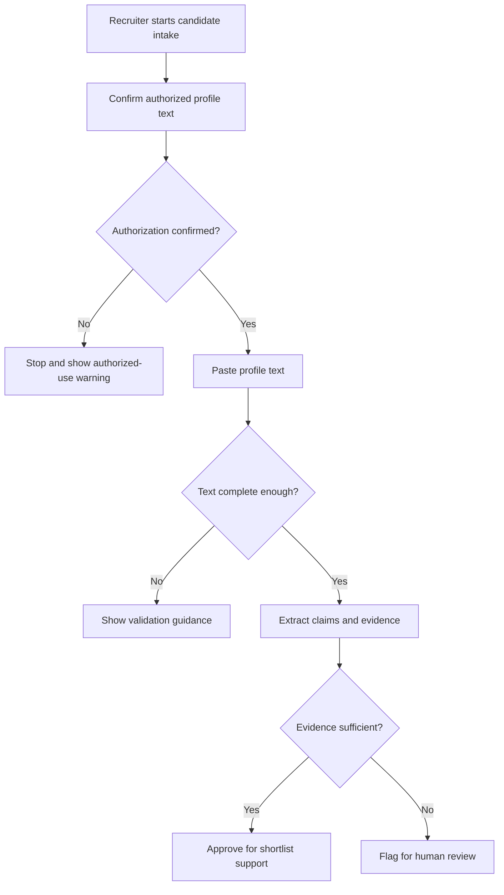
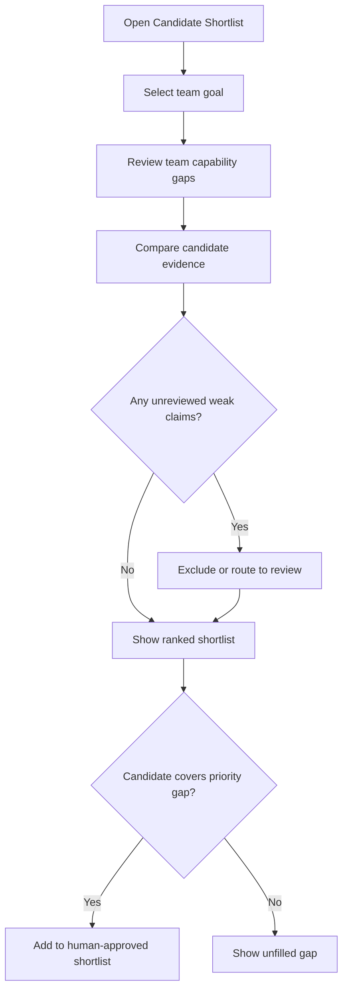
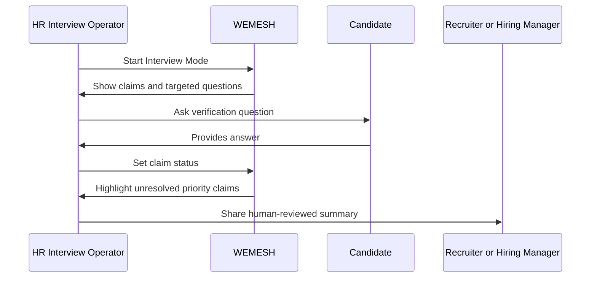
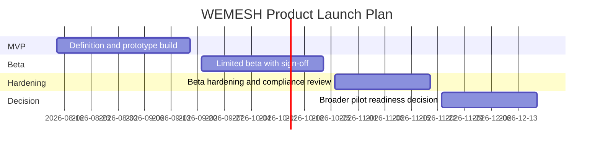

## Executive Summary

WEMESH will be a Team Knowledge Interview Copilot for recruiting teams that need faster, more evidence-based ways to evaluate candidates against fast-changing team capability needs. Hiring teams increasingly face polished profiles, unclear ownership of claimed experience, and shifting technical priorities that static job descriptions cannot capture. WEMESH addresses this opportunity by turning authorized pasted LinkedIn profile text into evidence-linked candidate claims, team-gap insights, shortlist recommendations, and targeted interview verification workflows.

The MVP will focus on an end-to-end demo experience: LinkedIn profile text paste, evidence-linked claim extraction, Candidate Shortlist, targeted interview question generation, and Interview Mode. It will use Next.js and TypeScript, local demo data, no authentication, and no database, while explicitly avoiding LinkedIn scraping, LinkedIn API usage, AI-generated-text detection, and automatic hire or reject decisions.

Recruiters benefit from faster shortlist prioritization, hiring managers benefit from team-gap-aligned candidate comparison, and HR interview operators benefit from structured claim verification during interviews. The key value proposition is human-centered decision support: WEMESH will help HR identify which candidate claims matter, why they matter to the team, and what to ask next—while keeping final hiring authority with people.

---

## Business Objectives and Success Criteria

| Objective | How the Product Delivers | Success Criteria | Measurement Method |
|-----------|--------------------------|------------------|--------------------|
| Improve shortlist quality and candidate-team fit accuracy | Prioritizes candidates by how well their evidence-backed claims align to team knowledge gaps and role needs. | [ASSUMPTION] In beta review, at least 70% of hiring-manager-reviewed top-3 shortlist recommendations are rated “useful” or “very useful” within 30 days of beta launch. | Hiring manager feedback form after each shortlist review. |
| Demonstrate end-to-end recruiting value quickly | Provides a guided flow from pasted profile text to extracted claims, gap reasons, shortlist ranking, and interview questions. | Complete the full MVP demo workflow in under 90 seconds in at least 90% of scripted demo runs. | Timed usability test across 10 scripted demo runs. |
| Increase evidence-based interview preparation | Generates targeted verification questions tied to candidate claims, evidence snippets, and team gaps. | [ASSUMPTION] At least 80% of generated interview questions are accepted or lightly edited by recruiters during beta sessions. | Recruiter question review actions and post-session feedback. |
| Reduce inappropriate reliance on low-confidence claims | Flags unsupported or low-confidence claims and requires human review before those claims influence ranking or interview prompts. | 100% of low-confidence or unsupported claims display a warning and require explicit human review before use in ranking or interview preparation. | Product QA checklist and beta audit review. |
| Establish privacy- and control-conscious beta readiness | Uses local demo data, avoids unauthorized platform access, and embeds privacy, audit, and retention expectations. | 100% of beta scenarios use authorized pasted text only and include visible consent/privacy guidance before profile processing. | Beta launch readiness checklist and participant observation. |

---

## Personas and Stakeholders

| Name | Type | Role | Goals | Pain Points | How Served |
|------|------|------|-------|-------------|------------|
| Recruiter | Persona | Screens many applicants for fast-changing technical teams. | Quickly identify promising candidates, understand evidence behind claims, and prepare targeted questions. | Time pressure, polished AI-assisted profiles, unclear candidate ownership of claimed work. | Candidate Shortlist ranks candidates with reasons, evidence warnings, and interview-question support. |
| Hiring Manager | Persona | Evaluates whether candidates fill current team capability gaps. | Understand team-gap fit, identify priority skill coverage, and review recommendation rationale. | Static job descriptions, moving team priorities, weak signals from resumes. | Team-gap discovery and ranking reasons show which candidate claims map to current team goals. |
| HR Interview Operator | Persona | Runs Interview Mode during candidate conversations. | Track claim status and guide verification discussion consistently. | Manual note tracking, missed follow-ups, inconsistent verification prompts. | Interview Mode supports claim statuses: Claimed, Needs Follow-up, Verified, and Not Verified. |
| HR/Product Sponsor | Stakeholder | Owns product value, rollout posture, and adoption targets. | Validate that the MVP improves shortlist quality and can scale beyond demo use. | Risk of a compelling demo that does not change hiring behavior. | Beta metrics and feedback gates measure whether users trust and use recommendations. |
| Compliance / Privacy Reviewer | Stakeholder | Ensures candidate data handling meets privacy and control expectations. | Protect PII, ensure consent-based use, define retention, and avoid unauthorized data collection. | Candidate profile data is sensitive and hiring decisions carry compliance risk. | Product rules require authorized paste only, warning states, human sign-off, auditability, and retention boundaries. |
| Engineering Lead | Stakeholder | Delivers the MVP within technical constraints. | Build a reliable demo using Next.js, TypeScript, local data, and Daytona port 3000. | Scope creep, unresolved extraction approach, and ranking-formula ambiguity. | Clear MVP boundaries, open questions, and phased rollout gates manage delivery risk. |

---

## User Stories and Acceptance Criteria

| ID | As a... | I want to... | So that... | Priority | Acceptance Criteria |
|----|---------|-------------|-----------|----------|---------------------|
| US-001 | Recruiter | paste authorized LinkedIn profile text into WEMESH | candidate claims can be extracted without scraping or platform integration | P0 | Given I have candidate-authorized profile text, When I paste it into the product, Then the system accepts the text for analysis; Given the text is empty or too short, When I submit it, Then I receive an actionable validation message and no candidate record is created. |
| US-002 | Recruiter | see extracted claims linked to supporting evidence snippets | I can distinguish supported claims from weak or unsupported claims | P0 | Given valid pasted text, When extraction completes, Then claims display evidence snippets, source text references, and confidence indicators; Given a claim lacks support, When it is shown, Then it is marked as unsupported or low-confidence. |
| US-003 | Hiring Manager | view team knowledge gaps tied to team goals | I can see which candidate capabilities matter most for current needs | P1 | Given team profile data and team goals exist in local demo data, When I open the team-gap view, Then missing or under-covered capabilities are shown with priority labels; Given no team goal is selected, Then the system prompts me to select or use a demo goal. |
| US-004 | Hiring Manager | compare candidates by team-gap fit rather than only role fit | I can prioritize candidates who fill the most important gaps | P0 | Given candidate claims and team gaps are available, When I view ranking results, Then candidates are ordered by a documented fit score and each ranking includes reasons; Given a ranking uses low-confidence claims, Then those claims are excluded until reviewed by a human. |
| US-005 | Recruiter | review a Candidate Shortlist with recommendation reasons | I can decide which candidates should move forward for interview preparation | P0 | Given candidate analysis has completed, When I open Candidate Shortlist, Then I see ranked candidates, top matched gaps, evidence status, and recommendation reasons; Given no candidates are available, Then I see an empty-state message with next-step guidance. |
| US-006 | Recruiter | generate targeted interview questions from candidate claims | I can verify ownership, depth, and relevance of claimed experience | P0 | Given a candidate has supported or reviewed claims, When I request questions, Then the system generates claim-specific questions tied to evidence and team gaps; Given claims remain unsupported, Then questions include warning context or are withheld until review based on product policy. |
| US-007 | HR Interview Operator | mark each claim as Claimed, Needs Follow-up, Verified, or Not Verified | interview outcomes are tracked consistently | P0 | Given I am in Interview Mode, When I update a claim status, Then the selected status is visibly saved for the session; Given I try to finish with unresolved high-priority claims, Then the system highlights them before completion. |
| US-008 | HR Interview Operator | capture human sign-off before recommendations influence decisions | WEMESH remains decision support rather than automated hiring | P0 | Given a shortlist or interview summary is ready, When I proceed to decision support output, Then the system requires explicit human confirmation that recommendations were reviewed; Given confirmation is not provided, Then the output remains marked as not approved for hiring use. |
| US-009 | Compliance Reviewer | ensure candidate profile text is handled with privacy warnings and retention limits | candidate data is used responsibly during beta | P0 | Given a user enters profile text, When the workflow begins, Then privacy guidance and authorized-use reminders are visible; Given demo data is no longer needed, Then retention rules identify how it will be purged or reset. |

---

## Business Process Overview

### Process 1: Authorized Profile Intake and Evidence Review

This process enables a recruiter to convert authorized pasted profile text into reviewable candidate claims. Its business purpose is to make candidate self-representation transparent and evidence-aware without scraping external platforms.

**Trigger event:** A recruiter starts a new candidate review and pastes candidate-authorized profile text.

**Step-by-step flow with inputs/outputs:**
1. **Recruiter confirms authorization** — Input: candidate profile text and authorization acknowledgment. Output: intake allowed or blocked.
2. **System checks completeness** — Input: pasted text. Output: accepted text or validation warning.
3. **System extracts candidate claims** — Input: accepted text. Output: claims, evidence snippets, confidence indicators.
4. **Recruiter reviews claim quality** — Input: extracted claims and evidence. Output: approved claims, low-confidence warnings, or rejected claims.
5. **Decision point: sufficient evidence?** If yes, claims can support shortlist and questions. If no, claims remain visible but require human review before influence.

**Error/exception paths:** Empty text, unauthorized text, or unreadable content results in a clear stop message. Low-confidence claims are not silently discarded; they are flagged and routed to human review.

**Participants:** Recruiter, WEMESH, Compliance/Privacy Reviewer for policy standards.

**Business outcome achieved:** Candidate claims become transparent, reviewable, and ready for responsible decision support.

### Process 2: Team-Gap Shortlist Review

This process helps hiring managers and recruiters understand which candidates best address current team capability needs. Its purpose is to shift shortlist discussion from generic role matching to evidence-backed team fit.

**Trigger event:** A recruiter or hiring manager opens Candidate Shortlist for a selected team goal.

**Step-by-step flow with inputs/outputs:**
1. **Select team goal** — Input: team objective or demo goal. Output: prioritized capability needs.
2. **Review team gaps** — Input: team member profiles and goals. Output: visible missing or under-covered capabilities.
3. **Compare candidate claims** — Input: candidate claims, evidence status, team gaps. Output: ranked candidate shortlist with reasons.
4. **Decision point: ranking contains unreviewed low-confidence claims?** If yes, those claims are excluded or blocked until reviewed. If no, recommendation reasons are shown.
5. **Recruiter shortlists candidates** — Input: ranked candidates and reasons. Output: human-approved shortlist for interview preparation.

**Error/exception paths:** If team data is missing, the user receives a demo-data setup prompt. If no candidate covers a gap, the product shows the gap as unfilled rather than forcing a recommendation.

**Participants:** Hiring Manager, Recruiter, WEMESH.

**Business outcome achieved:** A transparent, human-approved shortlist tied to team needs.

### Process 3: Interview Mode Claim Verification

This process supports structured interviews by turning claims into targeted questions and trackable statuses. Its business purpose is to help interviewers verify ownership, depth, and relevance while keeping final judgment with HR and hiring teams.

**Trigger event:** An HR Interview Operator starts Interview Mode for a shortlisted candidate.

**Step-by-step flow with inputs/outputs:**
1. **Open candidate interview workspace** — Input: shortlisted candidate and reviewed claims. Output: interview-ready claim list.
2. **Review targeted questions** — Input: claims, evidence, team gaps. Output: selected verification questions.
3. **Ask and assess** — Input: candidate answers. Output: updated claim understanding.
4. **Set claim status** — Input: interviewer judgment. Output: Claimed, Needs Follow-up, Verified, or Not Verified status.
5. **Decision point: unresolved high-priority claims?** If yes, prompt follow-up before interview close. If no, capture human sign-off.

**Error/exception paths:** If questions cannot be generated from reliable claims, the operator is warned and can proceed with manual questions. If sign-off is missing, the session remains incomplete.

**Participants:** HR Interview Operator, Candidate, Recruiter or Hiring Manager as reviewers.

**Business outcome achieved:** Structured, evidence-based interview notes with explicit human review.

---

## Business Rules and Policies

| Rule | When It Applies | User Experience | Example |
|------|----------------|-----------------|---------|
| Authorized profile text only | When a user begins profile intake. Condition: user must confirm the text is authorized for recruiting review. Action: allow intake only after confirmation. Exception: if authorization is not confirmed, block the workflow. | The user sees an authorized-use reminder before processing. | A recruiter pastes text copied from a candidate-provided profile export and confirms authorization; a recruiter attempting to proceed without confirmation is stopped. |
| No external platform scraping or platform API use | When collecting candidate profile information. Condition: user attempts to use anything other than pasted text. Action: direct the user back to manual paste. Exception: none for MVP. | The product positions paste as the only supported intake method. | A recruiter asks to import directly from LinkedIn; the MVP explains that only pasted text is supported. |
| Low-confidence claims require human review | When a claim lacks enough supporting evidence or has low confidence. Condition: the claim is unsupported or ambiguous. Action: display a warning and prevent influence on ranking or interview prompts until reviewed. Exception: the claim may remain visible as “needs review.” | Users see a warning badge and review requirement. | “Led cloud migration” appears without detail; it is shown but excluded from fit scoring until reviewed. |
| Human final decision authority | When shortlist recommendations, interview summaries, or fit reasons are presented. Condition: a recommendation could influence hiring progression. Action: require explicit human sign-off and state that WEMESH is decision support. Exception: no automatic hire/reject action is allowed. | Users approve or reject recommendation use manually. | A candidate appears first in the shortlist, but the recruiter must still decide whether to advance them. |
| PII protection and log masking | When candidate names, profile details, or interview notes are displayed, exported, or logged. Condition: data includes candidate-identifying details. Action: classify as restricted/confidential, mask in logs, and avoid unnecessary exposure. Exception: authorized users in the demo may view needed details. | Users receive privacy-conscious handling and minimal exposure. | Candidate contact details are not shown in diagnostic messages or operational logs. |
| Data retention and purge definition | When demo profile text, claims, or interview statuses are stored for a beta session. Condition: candidate data is no longer needed for the beta purpose. Action: purge or reset data according to defined retention limits. Exception: retained audit summaries must avoid unnecessary PII where possible. | Users understand how long beta data remains available. | Beta test candidate data is reset at the end of a test cycle unless approved for continued review. |
| Auditability of significant actions | When a user reviews a claim, changes a claim status, approves shortlist use, or completes interview sign-off. Condition: action affects candidate evaluation. Action: record actor, timestamp, resource, and change details. Exception: logs must not reveal sensitive profile content unnecessarily. | Important decisions are traceable without exposing more data than needed. | An operator changes a claim from “Needs Follow-up” to “Verified”; the change is traceable for review. |
| Clear error handling | When intake, extraction, ranking, or question generation cannot complete. Condition: user input is invalid, data is missing, or the system cannot produce reliable output. Action: show an actionable message and safe fallback. Exception: never fail open into unsupported recommendations. | Users receive guidance rather than silent failure. | If no team goal is selected, the shortlist explains that a goal is required before ranking. |

---

## Success Metrics and KPIs

| Metric | Target | Measurement Method | Timeline | Business Impact |
|--------|--------|--------------------|----------|-----------------|
| **Primary: Hiring-manager usefulness of top-3 shortlist** | [ASSUMPTION] ≥70% of reviewed top-3 recommendations rated “useful” or “very useful.” | Beta feedback form after shortlist review. | By 2026-10-09 beta checkpoint. | Validates the core objective of improving shortlist quality and candidate-team fit accuracy. |
| **Primary: End-to-end demo completion time** | ≥90% of scripted demo runs completed in under 90 seconds. | Timed demo testing. | By 2026-09-18 MVP readiness review. | Proves WEMESH can deliver rapid recruiting insight. |
| **Primary: Human sign-off coverage** | 100% of shortlist and interview summaries require explicit human sign-off. | QA checklist and beta session review. | From MVP onward. | Prevents automated hiring decisions and preserves accountable review. |
| **Secondary: Evidence linkage coverage** | [ASSUMPTION] ≥85% of extracted claims in demo scenarios display at least one evidence snippet or explicit unsupported warning. | Claim review QA sample. | By 2026-09-18 MVP readiness review. | Builds trust in recommendations and interview prompts. |
| **Secondary: Interview question acceptance** | [ASSUMPTION] ≥80% of generated questions accepted or lightly edited by recruiters. | Recruiter review action tracking and survey. | By 2026-10-09 beta checkpoint. | Measures whether generated questions improve interview preparation. |
| **Secondary: Interview Mode completion** | [ASSUMPTION] ≥90% of beta interview sessions close with all high-priority claims marked Verified, Not Verified, or Needs Follow-up. | Interview session review. | By 2026-10-23 beta exit review. | Ensures structured claim handling during interviews. |
| **Guardrail: Unsupported-claim influence** | 0 unsupported or unreviewed low-confidence claims influence ranking or prompts. | Policy QA checks and beta audit review. | Continuous during beta. | Reduces risk of misleading recommendations. |
| **Guardrail: Privacy exception rate** | 0 confirmed unauthorized profile-processing incidents. | Beta incident log and participant reporting. | Continuous during beta. | Protects candidates and supports GDPR/CCPA-aligned posture. |
| **Guardrail: Critical workflow failure rate** | [ASSUMPTION] <2% of demo workflow attempts end in unrecoverable failure. | Demo run logs and tester reports. | By 2026-09-18 MVP readiness review. | Maintains confidence in stakeholder demos and beta sessions. |

---

## Risks, Assumptions, Dependencies, and Constraints

### Risks

| Risk | Probability | Business Impact | Trigger Conditions | Mitigation | Owner |
|------|------------|-----------------|-------------------|------------|-------|
| Ranking formula does not match hiring-manager judgment | Medium | Shortlist recommendations may be distrusted or ignored. | Beta reviewers rate top recommendations below target usefulness. | Start with explainable weighted scoring, capture feedback, and tune weights before broader rollout. | Product Manager + Hiring Manager Sponsor |
| Profile extraction approach is not reliable enough for demo | Medium | Demo may fail to produce useful claims or evidence in under 90 seconds. | Extracted claims are missing, vague, or not tied to evidence. | Use deterministic demo fixtures or a hybrid extraction approach until the extraction strategy is finalized. | Engineering Lead |
| Users over-trust AI-assisted recommendations | High | Hiring decisions may become biased or insufficiently reviewed. | Users advance candidates based only on rank order. | Require human sign-off, warning labels, and recommendation explanations; prohibit auto-hire/reject behavior. | HR/Product Sponsor |
| Privacy or consent expectations are not met | Medium | Candidate trust and beta compliance posture could be harmed. | Profile text is processed without authorization or retained too long. | Add authorized-use confirmation, data classification, retention rules, and incident review. | Compliance / Privacy Reviewer |
| Scope grows beyond local MVP constraints | Medium | Delivery timeline slips and beta readiness is delayed. | Requests for authentication, database persistence, external integrations, or live platform imports before MVP. | Enforce MVP scope and move integration requests to future consideration. | Product Manager |
| Visualization or interaction design becomes too complex | Low | Users may not understand relationship-heavy outputs quickly. | Recruiters cannot interpret shortlist reasons during usability testing. | Prioritize shortlist and interview workflows over complex visualization depth. | Product Designer |

### Assumptions

| Assumption | Impact if Wrong | Validation Plan |
|-----------|----------------|----------------|
| [ASSUMPTION] Recruiters can obtain and paste candidate-authorized LinkedIn profile text for beta scenarios. | Intake workflow may be impractical or legally constrained. | Validate with beta recruiters and compliance reviewer before beta start. |
| [ASSUMPTION] Local demo data is sufficient to demonstrate team profiles, team goals, candidate claims, evidence, questions, and ranking. | MVP may not feel realistic enough for sponsor approval. | Conduct scripted demo review with recruiters and hiring managers. |
| [ASSUMPTION] A transparent weighted ranking model will be acceptable for MVP. | Engineering may need a different model or more data than planned. | Review scoring logic with hiring managers during MVP design. |
| [ASSUMPTION] Claim status values of Claimed, Needs Follow-up, Verified, and Not Verified are sufficient for beta interviews. | Interview operators may need additional statuses or notes. | Observe beta interview simulations and collect operator feedback. |

### Dependencies

| System/Team | Dependency | Timeline | Impact if Delayed |
|------------|------------|----------|------------------|
| Product + Hiring Manager Sponsor | Define initial ranking weights for team-gap relevance, evidence strength, and recency. | By 2026-08-28 | Shortlist reasons may remain ambiguous. |
| Engineering | Build Next.js + TypeScript MVP using local JSON demo data and Daytona port 3000. | By 2026-09-18 | MVP demo readiness slips. |
| Compliance / Privacy Reviewer | Approve consent, data handling, retention, and human-signoff wording. | By 2026-09-11 | Beta launch may be blocked. |
| Recruiter and HR Interview Operator beta participants | Provide feedback on shortlist usefulness and Interview Mode workflows. | 2026-09-21 to 2026-10-23 | Product-market fit evidence remains weak. |
| Design/Product | Create clear shortlist, warning, and Interview Mode interaction patterns. | By 2026-09-04 | Users may misinterpret recommendations or claim confidence. |

### Constraints

| Constraint | Type | Impact |
|-----------|------|--------|
| Use Next.js and TypeScript. | technical | Technology choices must align with this stack. |
| Run in Daytona sandbox on port 3000. | technical | Deployment and demo setup must support this environment. |
| No authentication for MVP. | technical | Access controls must rely on beta operating procedures and demo boundaries; production-grade access is future scope. |
| No database; use local JSON demo data. | technical | Persistence, multi-user history, and production retention automation are limited in MVP. |
| LinkedIn profile text paste only; no scraping or LinkedIn API. | business | Data collection is manual and consent-centered. |
| Do not include an AI-generated-text detector. | business | Product focuses on verification, not detection. |
| Do not automatically hire or reject candidates. | regulatory | All recommendations must remain decision support. |
| GDPR/CCPA + SOC 2-style controls must be called out. | regulatory | Privacy, retention, audit, and human-review requirements must be explicit. |

---

## Scope, NFRs, and Open Questions

### In Scope

- Authorized LinkedIn profile text paste for candidate intake.
- Evidence-linked candidate claim extraction.
- Candidate Shortlist with ranking reasons and human review gates.
- Targeted interview question generation from reviewed claims, evidence, team gaps, and seniority context.
- Interview Mode with claim statuses: Claimed, Needs Follow-up, Verified, and Not Verified.
- Team member profile grouping for team capability mapping.
- Team goal knowledge gap discovery using local demo data.
- Local JSON demo data supporting candidates, teams, roles, skills, claims, evidence, questions, and relationship visualization.
- Limited beta workflow with explicit feedback capture.

### Out of Scope

- Authentication or production identity management.
- Database persistence.
- LinkedIn scraping.
- LinkedIn API integration.
- Automated hiring or rejection decisions.
- AI-generated-text detection.
- Candidate-facing interview assistance.
- ATS, HRIS, calendar, video interview, or background-check integrations.
- Production-scale data retention automation beyond MVP policy definition.

### Future Consideration

- Production authentication, authorization, and role-based access.
- Persistent storage and enterprise audit history.
- ATS and HRIS integrations.
- Configurable ranking weights for hiring managers.
- More sophisticated semantic matching and feedback-loop learning.
- Exportable interview packets and structured panel feedback.
- Expanded accessibility testing with representative HR users.
- Production privacy automation for data-subject access, rectification, erasure, and portability.

### Non-Functional Requirements

- **Performance**: The scripted MVP workflow must complete in under 90 seconds in at least 90% of demo runs. [ASSUMPTION] Primary interactive views should render within 2 seconds for demo-sized local data.
- **Security**: The MVP has no authentication by constraint, so beta use must be limited to controlled demo participants. User-provided text must be validated, sensitive data must not appear in diagnostic messages, and production scope must add role-based access before broader release.
- **Accessibility**: [ASSUMPTION] MVP should target WCAG 2.1 AA for core workflows, including keyboard navigation, readable contrast, labels for status indicators, and non-color-only warnings.
- **Scalability**: MVP is designed for demo-sized local data. [ASSUMPTION] Beta scenarios should support at least 10 candidates, 5 team members, and 25 claim records per scripted scenario without workflow degradation.
- **Compliance**: PRD must explicitly address GDPR/CCPA privacy principles and SOC 2-style controls including auditability, data classification, retention/purge, PII protection, input validation, and safe error handling.

### Open Questions

1. **Ranking formula owner: Product Manager + Hiring Manager Sponsor** — What exact weights should be used for team-gap relevance, evidence strength, recency, proficiency, and manager-adjustable priorities?
2. **Extraction approach owner: Engineering Lead + Product Manager** — Should MVP extraction use deterministic demo logic, an LLM-backed flow, a hybrid approach, or manually pre-tagged demo data?
3. **Visualization library owner: Engineering Lead + Product Designer** — Which graph/relationship visualization library should be selected for the Next.js MVP?
4. **Retention period owner: Compliance / Privacy Reviewer** — What exact retention duration should apply to beta candidate profile text, extracted claims, and interview status records?
5. **Beta participant policy owner: HR/Product Sponsor** — Which recruiting teams and candidate scenarios are approved for limited beta testing?
6. **Question quality rubric owner: Hiring Manager Sponsor** — What criteria define an acceptable targeted verification question by role seniority and function?

---

## Rollout Plan

1. **Phase 1 — MVP Definition and Prototype Build**
   - **Timeline:** 2026-08-14 to 2026-09-18
   - **Description:** Build the first end-to-end WEMESH demo using Next.js, TypeScript, local JSON demo data, and the two required views: Candidate Shortlist and Interview Mode.
   - **Key milestones and deliverables:** MVP workflow definition by 2026-08-21; ranking-weight proposal by 2026-08-28; core UI prototype by 2026-09-04; privacy/sign-off copy review by 2026-09-11; demo readiness by 2026-09-18.
   - **Dependencies:** Product, engineering, design, hiring-manager sponsor, compliance/privacy reviewer.
   - **Success gates:** Demo completes profile intake, extraction, team-gap discovery, ranking inversion, recommendation reasons, targeted questions, and Interview Mode in under 90 seconds; 100% of low-confidence claims show warning behavior; no auto-hire/reject flows exist.
   - **Owner:** Engineering Lead with Product Manager.

2. **Phase 2 — Limited Beta with Human Sign-Off**
   - **Timeline:** 2026-09-21 to 2026-10-23
   - **Description:** Run controlled beta sessions with recruiters, hiring managers, and HR interview operators using approved demo or authorized pasted profile text.
   - **Key milestones and deliverables:** Beta onboarding guide by 2026-09-21; first recruiter sessions by 2026-09-25; hiring-manager shortlist review by 2026-10-02; interview-operator simulations by 2026-10-09; beta findings report by 2026-10-23.
   - **Dependencies:** Approved beta participants, privacy guidance, feedback capture forms, stable MVP demo.
   - **Success gates:** At least 70% [ASSUMPTION] usefulness rating for reviewed top-3 shortlist recommendations; 100% human sign-off completion for recommendation outputs; zero confirmed unauthorized profile-processing incidents.
   - **Owner:** HR/Product Sponsor with Product Manager.

3. **Phase 3 — Beta Hardening and Compliance Review**
   - **Timeline:** 2026-10-26 to 2026-11-20
   - **Description:** Incorporate beta feedback, refine ranking explanations, strengthen warning states, and validate privacy/audit/retention expectations for broader stakeholder review.
   - **Key milestones and deliverables:** Prioritized beta backlog by 2026-10-30; revised scoring and question-quality rubric by 2026-11-06; compliance review package by 2026-11-13; release-candidate demo by 2026-11-20.
   - **Dependencies:** Beta findings, compliance reviewer availability, engineering capacity.
   - **Success gates:** Guardrail metrics remain within target; critical usability issues resolved; compliance reviewer approves broader pilot posture.
   - **Owner:** Product Manager with Compliance / Privacy Reviewer.

4. **Phase 4 — Broader Pilot / GA Readiness Decision**
   - **Timeline:** 2026-11-23 to 2026-12-18
   - **Description:** Decide whether WEMESH is ready for broader pilot adoption or requires additional iteration before general availability planning.
   - **Key milestones and deliverables:** Pilot readiness assessment by 2026-12-04; sponsor decision review by 2026-12-11; next-phase roadmap by 2026-12-18.
   - **Dependencies:** MVP performance evidence, beta outcomes, open-question resolution.
   - **Success gates:** Sponsor approves value case; hiring managers confirm shortlist usefulness; compliance/privacy risks are accepted or mitigated; future production requirements are documented.
   - **Owner:** HR/Product Sponsor.

